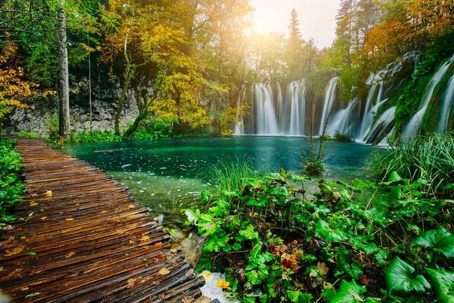
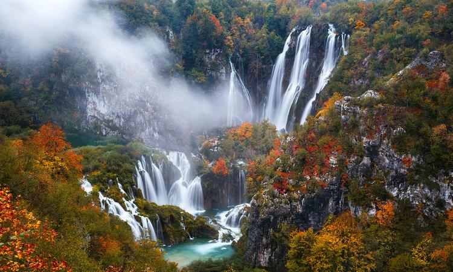
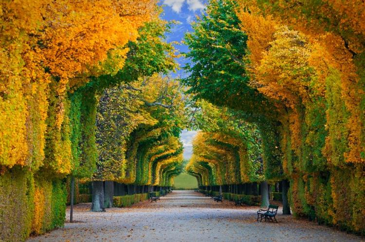

# Where to go in the fall, if you did not have enough summer

Crimson and gold leaves, blue sky, lakes and canals, the atmosphere imbued with a touch of sadness that swept the crowds of tourists - all this is Europe in autumn. An unforgettable experience is guaranteed!

## Croatia. Dubrovnik and Plitvice lakes

The medieval city of Dubrovnik in Croatia is best visited in the autumn, when there are no summer crowds of tourists, and the Adriatic Sea is still quite warm and suitable for swimming. In Dubrovnik, you should get lost in a labyrinth of narrow streets, hang out in a restaurant with a glass of local wine, visit the fortress of St. Lawrence and Revelin Fortress, climb the cable car to the Srd hill to see more panoramic views of the city and its surroundings. If you are a fan of "Game of Thrones", you will be delighted with a tour of the places of the series.  

If you are lucky enough to be in Croatia in autumn, be sure to go to the Plitvice Lakes National Park. You'll see a real explosion of flaming leaves among magnificent azure waterfalls and lakes. If you have the time, stay here longer and stay one day at a hotel to explore this natural masterpiece in the early morning, all alone or just the two of you, as you like.

## Austria. Vienna

Sophisticated nature will surely appreciate Vienna - in autumn it looks like a chapter from a magical fairy tale. This is a time of peace and quiet. Summer concerts in the open air are over, and the streets are just preparing for the madness of the Christmas fair. This is an ideal moment to admire Stefanplatz without the crowd. Climb the tower of St. Stephen's Cathedral to see Vienna in all its autumn glory. 

And when you go downstairs, wrap up on the adjacent street and look into Mozart's house. Admire the gardens of Schoenbrunn Palace, where the carpet of autumn leaves will create the perfect background for the photo shoot. Then head to the Belvedere (Gustav Klimt's Kiss House) to warm yourself up with stunning paintings of ceilings, works of art and interiors, and then invite your partner for a waltz tour in the palace garden. Finish your day with the famous Wiener schnitzel and local beer in a cozy traditional tavern. Or, dressed in ashes, visit one of the city's iconic places - Vienna Opera. Definitely, this city can't be missed during the foliage!

